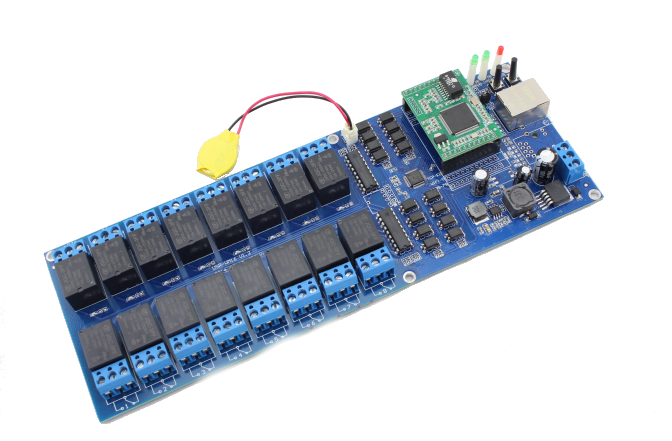

# USR-R16 for Home Assistant 🔌

  

  

[![BuyMeCoffee][buymecoffeebadge]][buymecoffee]

---

A Home Assistant custom integration for the **USR-R16** — a 16-channel TCP relay board manufactured by [USR IOT](https://www.usr.cn/).

This is a fork of [blindlight86/HA_USR-R16](https://github.com/blindlight86/HA_USR-R16), rewritten as a proper config-entry-based integration compatible with modern Home Assistant versions.

---

## Features

- **16 relay switches** exposed as individual `switch` entities
- **Auto-discovery** of USR-R16 devices on the local network (UDP broadcast + TCP scan)
- **Local push** connection over TCP — no cloud dependency
- Automatic **reconnection** on connection loss
- **Keep-alive** mechanism to maintain the TCP link
- UI-based configuration via the Home Assistant **Config Flow**
- HACS-compatible

---

## Requirements

| Requirement | Version |
|---|---|
| Home Assistant | ≥ 2022.7.5 |

---

## Installation

### Via HACS (recommended)

1. Open **HACS** in your Home Assistant instance.
2. Go to **Integrations** → click the three-dot menu → **Custom repositories**.
3. Add `https://github.com/Elwinmage/ha-usr-r16-component` as an **Integration**.
4. Search for **USR-R16** and click **Download**.
5. Restart Home Assistant.

### Manual

1. Download or clone this repository.
2. Copy the `custom_components/usr_r16/` folder into your Home Assistant `config/custom_components/` directory.
3. Restart Home Assistant.

---

## Configuration

1. Go to **Settings → Devices & Services → Add Integration**.
2. Search for **USR r16**.
3. Choose a setup method:

### Auto-discover (recommended)

Select **Auto-discover** to let the integration scan your local network automatically.

The integration uses two complementary methods:

- **UDP broadcast** (port 1901) — sends the USR proprietary discovery packet; devices reply with their IP and name. Fast (~3 s) but may be blocked by some managed switches or routers.
- **TCP port scan** (port 8899) — probes every host on your subnet in parallel as a fallback, in case UDP broadcast is filtered.

Once the scan completes, a list of discovered devices is shown. Devices that are **already configured** appear in the list but are marked as such and cannot be selected again. Select the device you want to add, confirm the password, and click **Submit**.

If no new device is found, the flow automatically falls back to manual entry.

### Manual

Select **Manual** to enter the connection details directly:

| Field | Description | Default |
|---|---|---|
| **Host** | IP address of the USR-R16 device | *(required)* |
| **Port** | TCP port of the device | `8899` |
| **Password** | Device password | `admin` |

Click **Submit**. Home Assistant will attempt to connect and validate the credentials.

Once added, **16 switch entities** are automatically created, named `usr_r16_1` through `usr_r16_16`, corresponding to the 16 relay channels.

---

## Device

The **USR-R16** is a 16-channel relay controller communicating over TCP. It is commonly used in home automation setups for controlling lights, pumps, or other equipment.

- **Protocol**: TCP (Local Push)
- **Default port**: 8899
- **Default password**: `admin`
- **Channels**: 16 independently controllable relays

---

## Entities

Each relay channel is exposed as a `switch` entity supporting the following actions:

| Action | Description |
|---|---|
| `turn_on` | Closes the relay (ON) |
| `turn_off` | Opens the relay (OFF) |
| `toggle` | Toggles the relay state |

Availability is tracked in real time: entities become **unavailable** if the TCP connection drops, and recover automatically when reconnected.

---

## Technical details

- **Connection type**: Local Push (event-driven, no polling)
- **Discovery — UDP broadcast port**: 1901
- **Discovery — TCP scan port**: 8899
- **Reconnect interval**: 10 seconds
- **Keep-alive interval**: 3 seconds
- **Connection timeout**: 10 seconds
- **YAML import**: Legacy `configuration.yaml` entries are automatically migrated to config entries

---

## Troubleshooting

**No device found during auto-discovery**
- Make sure the USR-R16 is powered on and connected to the same network as Home Assistant.
- If your network uses VLANs or a managed switch, UDP broadcast may be blocked — use **Manual** entry instead and enter the IP address directly.
- Try increasing the scan timeout if your network is slow.

**Cannot connect**
- Verify the IP address and port of your USR-R16 device.
- Make sure the device is reachable from your Home Assistant host (try `ping` or `telnet <host> 8899`).
- Check that the password is correct (default: `admin`).

**Device already configured**
- Each host/port combination can only be added once. If the device appears greyed out in the discovery list, it is already configured. Remove the existing entry before adding it again.

**Entities unavailable after restart**
- The integration reconnects automatically. Wait a few seconds; if the issue persists, check your network connectivity to the device.

---

## Links

- **Repository**: [github.com/Elwinmage/ha-usr-r16-component](https://github.com/Elwinmage/ha-usr-r16-component)
- **Issue tracker**: [github.com/Elwinmage/ha-usr-r16-component/issues](https://github.com/Elwinmage/ha-usr-r16-component/issues)
- **Original fork**: [github.com/blindlight86/HA_USR-R16](https://github.com/blindlight86/HA_USR-R16)

---

## License

This project is licensed under the [MIT License](LICENSE).

[buymecoffee]: https://paypal.me/Elwinmage
[buymecoffeebadge]: https://img.shields.io/badge/buy%20me%20a%20coffee-donate-yellow.svg?style=flat-square
